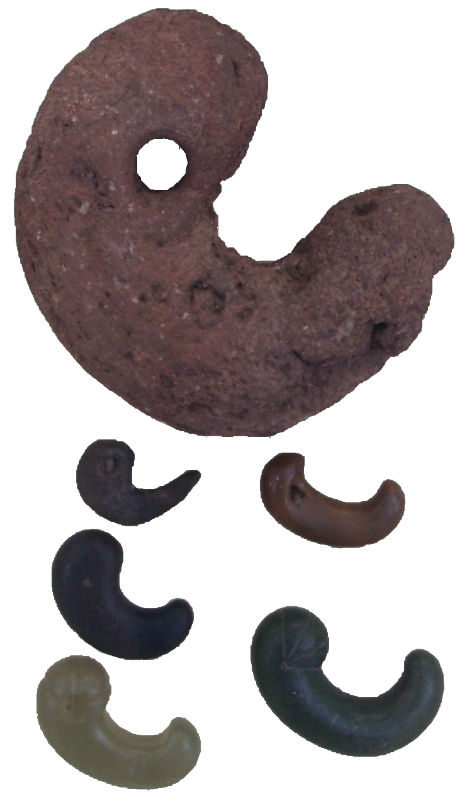
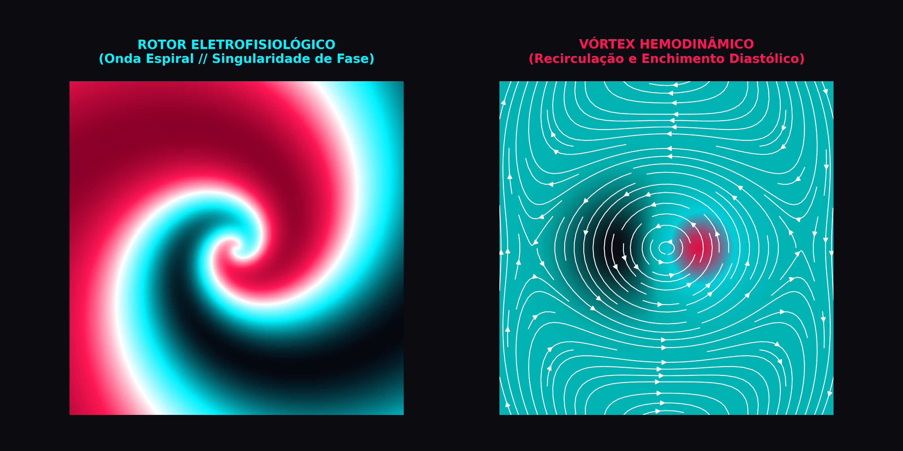

# 🎨 Identidade Visual e Conceito do Logotipo

  

<h1 align="center" style="font-size: 2.5rem; letter-spacing: 2px;">
  kokor心sim
</h1>

  O Rotor / Magatama (勾玉): A Convergência entre a Onda Espiral e o Vórtex Fluido

---

## 🌪️ 1. O Conceito: O Rotor / Magatama (A Onda Espiral e o Vórtex)

O logotipo do **KokoroSim** rejeita os clichês gráficos habituais da cardiologia (como corações vetoriais simplórios ou linhas genéricas de ECG com traçado estilizado). Em seu lugar, a identidade visual constrói uma síntese geométrica direta entre a **eletrofisiologia não-linear**, a **mecânica de fluidos intracardíaca** e a **iconografia clássica japonesa**.

  

    

      

        
      

      
Magatama (勾玉)

      
Artefato arqueológico imperial clássico em pedra de jade: a silhueta da gota espiralada primordial.

    

    

      

        
      

      
Mitsudomoe (三つ巴)

      
Símbolo heráldico de vórtices em rotação perpétua: a dinâmica do fluxo contínuo de recirculação.

    

  

  

    <i>Figura 1: A convergência iconográfica — O relevo orgânico do Magatama e o dinamismo rotacional do Mitsudomoe unificados como alicerces da marca.</i>
  

### A Base Visual
A silhueta é inspirada no **magatama** (勾玉) e no elemento dinâmico unitário do **mitsudomoe** (a tradicional forma de gota ou vírgula espiralada presente há milênios na arte nipônica). Longe de ser um mero adorno esotérico, a geometria foi retraduzida sob parâmetros estritamente biofísicos.

### A Convergência Multifísica
A forma espiralada resolve simultaneamente as duas físicas fundamentais simuladas pelo software:

1. **Na Eletrofisiologia Celular (O Choque):**
   Rotores são **ondas espirais auto-sustentadas** que giram ao redor de uma singularidade de fase em meio excitável (reentrância funcional). São o substrato matemático primordial para a gênese e manutenção de arritmias letais, taquicardias ventriculares e fibrilação.
2. **Na Hemodinâmica e Dinâmica de Fluidos (O Fluxo):**
   A mesma topologia espiralada descreve o **núcleo de recirculação e os anéis de vórtice transmitrais** (*vortex rings*) formados pelo sangue durante a fase de enchimento rápido ventricular diastólico, otimizando o direcionamento cinético da massa sanguínea em direção à via de saída aórtica.

  

  <i>Figura 2: A dualidade multifísica modelada no KokoroSim — À esquerda, o rotor elétrico de potencial de ação espiralado; à direita, o vórtice hidrodinâmico de recirculação ventricular.</i>

---

## 🎯 2. Execução Gráfica e Eficiência de Silhueta

Um logotipo para ferramentas científicas e de computação precisa resolver um desafio de engenharia visual: **manter impacto e legibilidade imediata tanto em 1-bit quanto em ícones de 24 pixels** (como avatares de repositório no GitHub, favicons ou executáveis de desktop).

### Traçado, Dinâmica Vetorial e o Raio/QRS
* **Projeção à Direita (O Raio e a Onda QRS):** A projeção afiada e agressiva voltada à direita evoca o formato angular de um **relâmpago (raio)** — simbolizando o estímulo bioelétrico — e reproduz com exatidão a morfologia rápida da **Onda R / Complexo QRS** do eletrocardiograma e a fase 0 da despolarização transmembrana (mediada pelos canais rápidos de sódio $I_{Na}$).
* **Núcleo em Recirculação:** O "corpo" arredondado fecha-se como uma espiral logarítmica de vórtice, traduzindo o turbilhonamento fluido e a dissipação de energia ventricular.

---

## 🈲 3. Tipografia Integrada e o Kanji 心 (Kokoro)

A tipografia do logotipo é geométrica, técnica e limpa, inspirada nas interfaces de controle de ficção científica e animes clássicos de mecha dos anos 90 (como *Neon Genesis Evangelion* e *Ghost in the Shell*):

$$\text{k} \cdot \text{o} \cdot \text{k} \cdot \text{o} \cdot \text{r} \cdot \mathbf{心} \cdot \text{s} \cdot \text{i} \cdot \text{m}$$

* **Integração Sutil e Autêntica:** O kanji **心** (*kokoro* — coração, mente, espírito) é fundido diretamente na estrutura tipográfica, **substituindo o terceiro "o" da palavra** (no término de *kokoro* e início de *sim*). 
* **Equilíbrio Semântico:** Essa substituição preserva a legibilidade da pronúncia global (*kokoro* + *sim*), transformando o caractere no ponto focal de ligação entre a herança conceitual nipônica e a simulação de alta performance.

---

## 🔴🔵 4. Paleta de Cores: A Dualidade Eletromecânica

Em vez dos degradês assépticos e esbranquiçados de softwares médicos hospitalares, o KokoroSim adota blocos de cor sólidos de altíssimo contraste sobre uma base preta profunda (*Dark Cyberpunk*):

| Cor | Hex | Função Biofísica e Semiótica |
| :--- | :--- | :--- |
| **Carmesim Neon** | `#ff1754` | Representa o sangue arterial oxigenado, o calor metabólico, a Pressão Aórtica ($AoP$) e a força inotrópica de ejeção ventricular. |
| **Ciano Elétrico** | `#00f2fe` / `#00cec9` | Representa a bioeletricidade celular, a polaridade iônica de repouso, a Pressão Ventricular Esquerda ($LVP$) e o sangue venoso. |
| **Amarelo Neon** | `#f1c40f` | Representa o retardo do Nó AV, a sincronia acústica e a telemetria do monitor de UTI. |
| **Fundo Profundo** | `#0a0c12` | O vazio eletrostático do chassi digital, destacando cada disparo iônico com brilho fosforescente. |

Essa combinação direta entre o **calor mecânico do sangue arterial (carmesim)** e a **eletricidade fria do potencial de ação e do sangue venoso (ciano)** sintetiza a própria essência do KokoroSim: **um simulador onde o pulso elétrico e a hidrodinâmica ventricular coexistem em perfeita harmonia matemática.**
